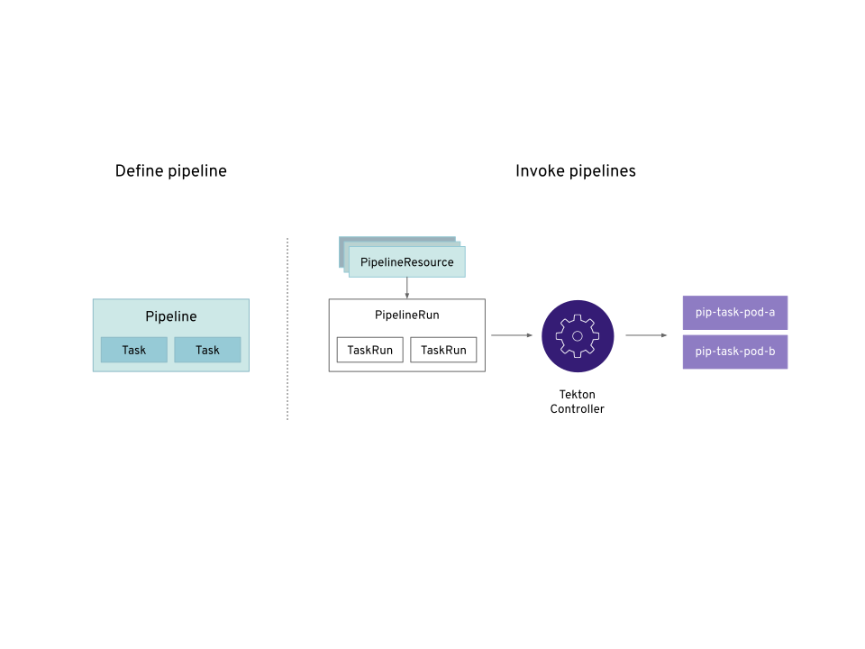

# OpenShift Pipelines Tutorial

Welcome to OpenShift Pipelines tutorial!

OpenShift Pipelines is a cloud-native continuous integration and delivery (CI/CD) solution for building pipelines using [Tekton](https://tekton.dev). Tekton is a flexible Kubernetes-native open-source CI/CD framework which enables automating deployments across multiple platforms (Kubernetes, serverless, VMs, etc) by abstracting away the underlying details. 

OpenShift Pipelines features:
  * Standard CI/CD pipelines definition based on Tekton
  * Build images with Kubernetes tools such as S2I, Buildah, Buildpacks, Kaniko, etc
  * Deploy applications to multiple platforms such as Kubernetes, serverless and VMs
  * Easy to extend and integrate with existing tools
  * Scale pipelines on-demand
  * Portable across any Kubernetes platform
  * Designed for microservices and decentralised team
  * Integrated with OpenShift Developer Console

This tutorial walks you through pipeline concepts and how to create and run a simple pipeline for building and deploying a containerized app on OpenShift.

## Prerequisite

You need an OpenShift 4 cluster in order to complete this tutorial. If you don't have an existing cluster, go to http://try.openshift.com and register for free in order to get an OpenShift 4 cluster up and running on AWS within minutes.

## Concepts

Tekton defines a number of [Kubernetes custom resources](https://kubernetes.io/docs/concepts/extend-kubernetes/api-extension/custom-resources/) as building blocks in order to standardise pipeline concepts and provide a temonology that is consistent across CI/CD solutions. These custom resources (CR) are an extension to the Kubernetes which let users create and interact with these objects using `kubectl` and other Kubernetes tools.

The custom resources needed to define a pipeline are:
* `Task`: a reusable loosely-coupled number of steps that perform a specific task e.g building a container image
* `Pipeline`: the definition of the pipeline and the `Task`s that it should perform
* `PipelineResource`: inputs (e.g. git repository) and outputs (image registry) to and out of a pipeline or task
* `TaskRun`: the result of running a instance of task
* `PipelineRun`: the result of running an instance of pipeline, which includes a number of `TaskRun`s

In short, in order to create a pipeline one does the following:
* Create custom or install [existing](https://github.com/tektoncd/catalog) reusable `Tasks`
* Create a `Pipeline` and `PipelneResource`s to define your applications delivery pipeline
* Create a `PipelineRun` to instantiate and invoke the pipeline

For further details on pipeline concepts, refer to the [Tekton documentation](https://github.com/tektoncd/pipeline/tree/master/docs#learn-more) which provides an excellent guide for understanding various parameters and attributes available for defining pipelines.

In the following sections, you will go through each of the above steps to define and invoke a pipeline.

## Install OpenShift Pipelines
TBD

## Install Tasks
TBD

## Create Pipeline
TBD

## Trigger Pipeline
TBD

