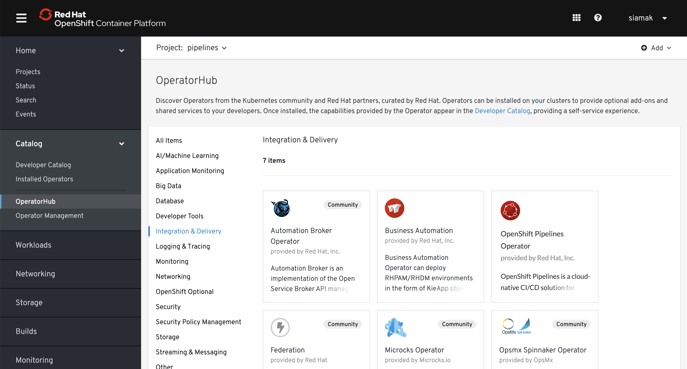

# OpenShift Pipelines Tutorial

Welcome to OpenShift Pipelines tutorial!

OpenShift Pipelines is a cloud-native continuous integration and delivery (CI/CD) solution for building pipelines using [Tekton](https://tekton.dev). Tekton is a flexible Kubernetes-native open-source CI/CD framework which enables automating deployments across multiple platforms (Kubernetes, serverless, VMs, etc) by abstracting away the underlying details. 

OpenShift Pipelines features:
  * Standard CI/CD pipelines definition based on Tekton
  * Build images with Kubernetes tools such as S2I, Buildah, Buildpacks, Kaniko, etc
  * Deploy applications to multiple platforms such as Kubernetes, serverless and VMs
  * Easy to extend and integrate with existing tools
  * Scale pipelines on-demand
  * Portable across any Kubernetes platform
  * Designed for microservices and decentralised team
  * Integrated with OpenShift Developer Console

This tutorial walks you through pipeline concepts and how to create and run a simple pipeline for building and deploying a containerized app on OpenShift.

## Prerequisite

You need an OpenShift 4 cluster in order to complete this tutorial. If you don't have an existing cluster, go to http://try.openshift.com and register for free in order to get an OpenShift 4 cluster up and running on AWS within minutes.


## Concepts

Tekton defines a number of [Kubernetes custom resources](https://kubernetes.io/docs/concepts/extend-kubernetes/api-extension/custom-resources/) as building blocks in order to standardise pipeline concepts and provide a temonology that is consistent across CI/CD solutions. These custom resources (CR) are an extension to the Kubernetes which let users create and interact with these objects using `kubectl` and other Kubernetes tools.

The custom resources needed to define a pipeline are:
* `Task`: a reusable loosely-coupled number of steps that perform a specific task e.g building a container image
* `Pipeline`: the definition of the pipeline and the `Task`s that it should perform
* `PipelineResource`: inputs (e.g. git repository) and outputs (image registry) to and out of a pipeline or task
* `TaskRun`: the result of running a instance of task
* `PipelineRun`: the result of running an instance of pipeline, which includes a number of `TaskRun`s


In short, in order to create a pipeline one does the following:
* Create custom or install [existing](https://github.com/tektoncd/catalog) reusable `Tasks`
* Create a `Pipeline` and `PipelneResource`s to define your applications delivery pipeline
* Create a `PipelineRun` to instantiate and invoke the pipeline

For further details on pipeline concepts, refer to the [Tekton documentation](https://github.com/tektoncd/pipeline/tree/master/docs#learn-more) which provides an excellent guide for understanding various parameters and attributes available for defining pipelines.

In the following sections, you will go through each of the above steps to define and invoke a pipeline.

## Install OpenShift Pipelines

OpenShift Pipelines is provided as an add-on on top of OpenShift which can be installed via an operator that is available in the OpenShift OperatorHub. Follow [these instructions](install-operator.md) in order to install OpenShift Pipelines on OpenShift via the OperatorHub. 



## Deploy Sample Application

Create a project for the sample application that you will be using in this tutorial.

```bash
oc new-project pipelines-tutorial
```

Building container images using build tools such as S2I, Buildah, Kaniko, etc require privileged access to the cluster. OpenShift default security setting does not allow privileged containers unless specifically configured. Create a service account for running pipelines and enable it to run privileged pods for building images:

```
oc create serviceaccount pipeline
oc adm policy add-scc-to-user privileged -z pipeline
oc adm policy add-role-to-user edit -z pipeline
```

You will use the [Spring PetClinic](https://github.com/spring-projects/spring-petclinic) sample application during this tutorial which is a simple Spring Boot application. 

Deploy the Spring PetClinic app on OpenShift using Source-to-Image which builds a container image from the application source code on GitHub and deploys it in the current namespace:

```bash
oc new-app java~https://github.com/spring-projects/spring-petclinic
oc expose svc/spring-petclinic
```

You can also configure the application health probes so that Kubernetes doesn't sent any traffic to the pods before the application is started:

```bash
oc set probe dc/spring-petclinic --readiness --liveness --get-url=http://:8080
```

Also set deployments for Spring PetClinic application to `manual` so that you can control the deployment workflow through a pipeline:

```bash
oc set triggers dc/spring-petclinic --manual
```

You should be able to see the application running in the Web Console.


## Install Tasks

`Task`s consists of a number of steps that are executed sequentially, each in a separate container within the same pod. They can also have inputs and outputs in order to interact with other tasks in the pipeline. 

Here is an example of a Maven task for building a Maven-based Java application:

```yaml
apiVersion: tekton.dev/v1alpha1
kind: Task
metadata:
  name: maven-build
spec:
  inputs:
    resources:
    - name: workspace-git
      type: git
  outputs:
    resources:
    - name: workspace-git
      type: git
  steps:
  - name: build
    image: maven:3.6.0-jdk-8-slim
    command:
    - /usr/bin/mvn
    args:
    - install
```

The Maven task starts a pod and runs a container inside that pod using the `maven:3.6.0-jdk-8-slim` image to run the specified commands. This task happen to have a single step, but tasks can have multiple steps and each runs inside a separate container within the same pod while having access to the same volumes in order to cache files, access configmaps, secrets, etc. The Maven task receives an input directory called `workspace-git` which is expected to contain the source code of the application. It also defines an output directory with the same name, in order to send the resulting artifacts to other tasks.

Save the above YAML in a file and then create the task within your project:

```shell
oc create -f maven-build-task.yaml
```

`Task`s are reusable and can be used in multiple pipelines. You can find more examples of re-usable `Task`s in the [catalog GitHub repository](https://github.com/tektoncd/catalog).

Install the `buildah` and `openshift-cli` tasks from the catalog repository which you will use for creating a pipeline in the next section:

```shell
oc create -f https://raw.githubusercontent.com/tektoncd/catalog/master/buildah/buildah.yaml
oc create -f https://raw.githubusercontent.com/tektoncd/catalog/master/openshift-cli/openshift-client-task.yaml 
oc create -f https://raw.githubusercontent.com/tektoncd/catalog/master/s2i/s2i-task.yaml 
```

## Create Pipeline

A `Pipeline` defines a number of tasks that should be executed and also how the tasks interact with each other via their inputs and outputs.

```yaml
```

## Trigger Pipeline
TBD

