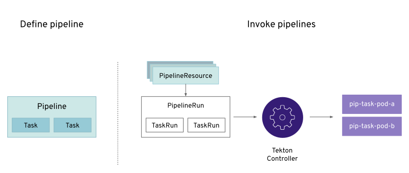

[id="openshift-pipeline-concepts_{context}"]
= OpenShift Pipeline concepts

Tekton provides native Kubernetes resources for building and executing CD pipelines. 

Tekton provides Kubernetes Custom Resource Definitions (CRD) for modelling CD pipelines. The CRDs provided by Tekton include: Pipeline, Task, PipelineRun, TaskRun, PipelineResource. 
Pipeline

* A Pipeline is a collection of `PipelineResources`,` Parameters` and one or more `Task`s. In order for a Pipeline to interact with the outside world, it will probably need PipelineResources which will be given to Tasks as inputs and outputs.

Your Pipeline must declare the PipelineResources it needs in a resources section in the spec, giving each a name which will be used to refer to these PipelineResources in the Tasks.

* Pipelines allow you to run a `Task` individually or as a part of a Pipeline. A task runs as a Pod on the Kubernetes cluster. Tekton pipelines include one or more Tasks with a Task consisting of one or more steps. Steps are a series of commands that are sequentially executed by the task
* `PipelineRun` is used to run a `Pipeline`. `PipelineRun` initiates the creation of a `TaskRun` for each `Task` being run in the `Pipeline`.
* `TaskRun` is auto-created by a `PipelineRun` for each `Task` in a `Pipeline`. `TaskRun` can also be manually created. This is done if a `Task` runs outside of a `Pipeline`.
* `PipelineResources` provide input and output for a Pipeline’s subsequent Tasks. `PipelineResources` currently support Git Resources, Image Resources, Cluster Resources, and Storage Resources.

Tekton defines a number of [Kubernetes custom resources](https://kubernetes.io/docs/concepts/extend-kubernetes/api-extension/custom-resources/) as building blocks in order to standardise pipeline concepts and provide a terminology that is consistent across CI/CD solutions. These custom resources (CR) are an extension to the Kubernetes which let users create and interact with these objects using `kubectl` and other Kubernetes tools.

The custom resources needed to define a pipeline are:

* `Task`: a reusable loosely-coupled number of steps that perform a specific task e.g building a container image
* `Pipeline`: the definition of the pipeline and the `Task`s that it should perform
* `PipelineResource`: inputs (e.g. git repository) and outputs (image registry) to and out of a pipeline or task
* `TaskRun`: the result of running an instance of task
* `PipelineRun`: the result of running an instance of pipeline, which includes a number of `TaskRun`s

The steps normally followed in invoking a Pipeline include:

* Create custom or install existing reusable `Tasks`
* Create a `Pipeline` and `PipelineResource`s to define your applications delivery pipeline
* Create a `PipelineRun` to instantiate and invoke the pipeline

. Additional resources
* For further details on pipeline concepts, refer to the link:https://github.com/tektoncd/pipeline/tree/master/docs#learn-more[Tekton documentation].
