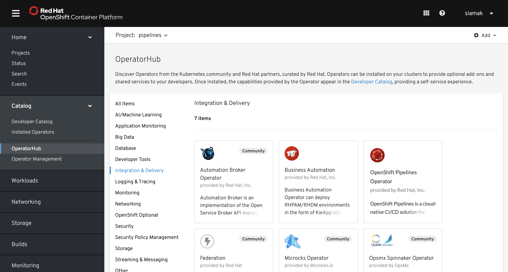
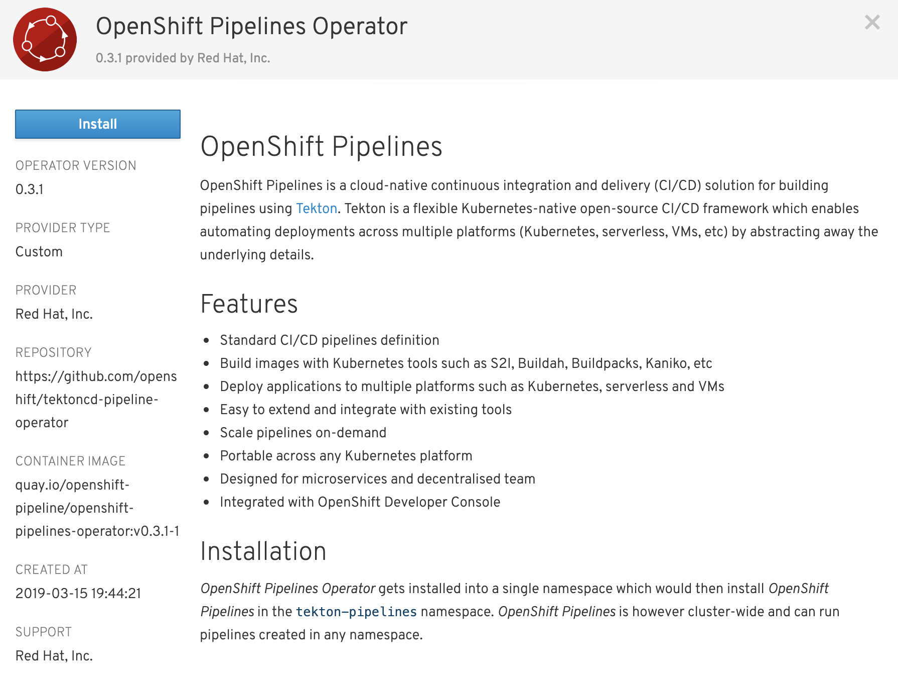
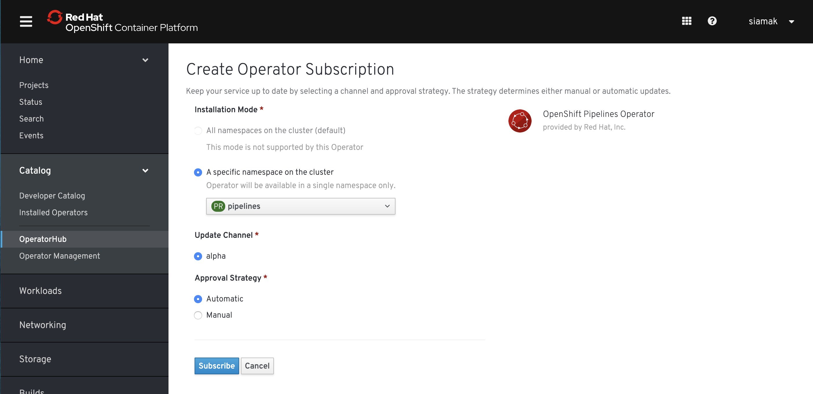

// The following module is included in the following assembly:
//
// 

[id='installing-openshift-pipelines-operator_{context}']
= Installing the OpenShift pipelines operator

OpenShift Pipelines can be installed by using an operator that is available in the OpenShift OperatorHub.

NOTE: The operator is located in the Community OperatorHub.

.Prerequisites

* An OpenShift 4 cluster is required for installation. Visit try.openshift.com for getting started information on setting up an OpenShift 4 cluster

.Procedure

. In the Web Console, scroll down and create a project called `pipelines` by clicking on **Projects > Create Project**.

NOTE: Alternatively you can use `oc` or `kubectl` to create the project. Use the command ``.

[start=2]
. Go to **Catalog > OperatorHub** in the Web Console. A list of operators for OpenShift, provided by Red Hat as well as a community of partners and open-source projects is available.

[start=3]
. Click on **OpenShift Pipelines Operator** and then on click **Install**

[start=4]
. Select the default values to install the operator in the `pipelines` project.  
. click on **Subscribe**.

NOTE: Once operator installation is complete, the status is updated from `1 installing` to `1 installed`. 
NOTE: This operator automates installation and updates of OpenShift Pipelines on the cluster and applies all needed configurations. 

[start=5]
. Click on `1 installed` to go the installed operator to complete the OpenShift Pipelines installation process.

[start=6]
. Now that the operator is installed, you can click on **Create New** on **OpenShift Pipelines Install** in order to install OpenShift Pipelines.

[start=7]
. Leave the example `Install` CR as-as and click on **Create**.

That's all. The operator now installs OpenShift Pipelines on the cluster.
