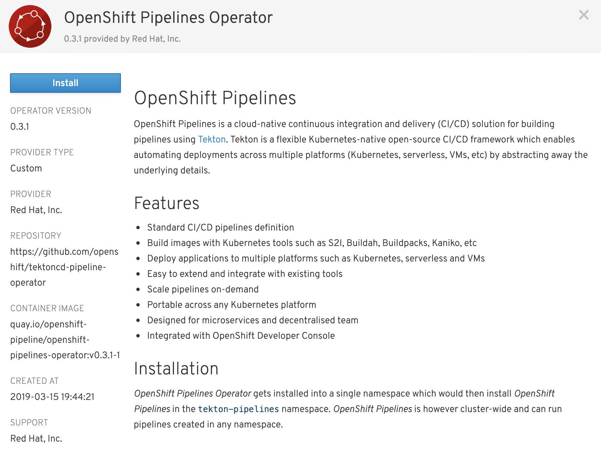
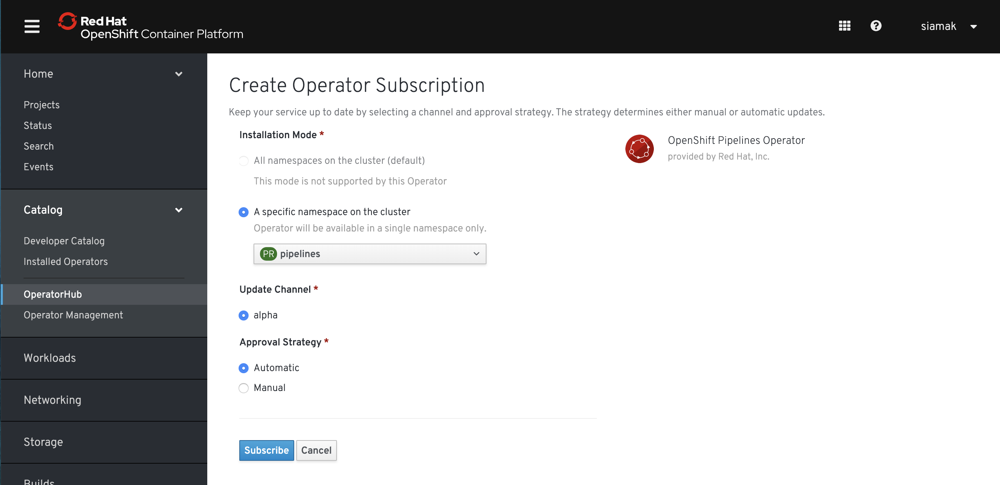

# Install OpenShift Pipelines

OpenShift Pipelines is provided as an add-on on top of OpenShift which can be installed via an operator that is available in the OpenShift OperatorHub.

Create a project called `pipelines` by clicking on **Projects > Create Project** in the Web Console. Alternatively you can use `oc` or `kubectl` to create the project.

Go to **Catalog > OperatorHub** in the Web Console. You can see the list of available operators for OpenShift, provided by Red Hat as well as a community of partners and open-source projects. 

Click on **Integration & Delivery** category to find **OpenShift Pipeline Operator**.

Click on **OpenShift Pipelines Operator** and then on **Install**

Leave the default values in order to install the operator in the `pipelines` project and click on **Subscribe** in order to subscribe to the installation and update channels.

As soon as the operator installation is completed, you would see the status updated from `1 installing` to `1 installed`. This operator automates installation and updates of OpenShift Pipelines on the cluster and applies all configurations needed. 

Click on `1 installed` to go the installed operator in order to install OpenShift Pipelines.

Now that the operator is installed, you can click on **Create New** on **OpenShift Pipelines Install** in order to install OpenShift Pipelines.

You can leave the example `Install` CR as-as and click on **Create**.

That's all. The operator now installs OpenShift Pipelines on the cluster.
